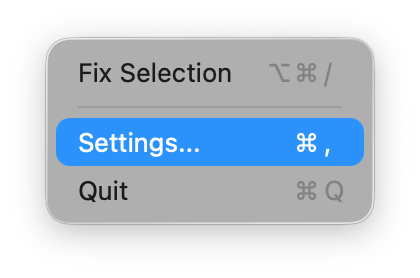
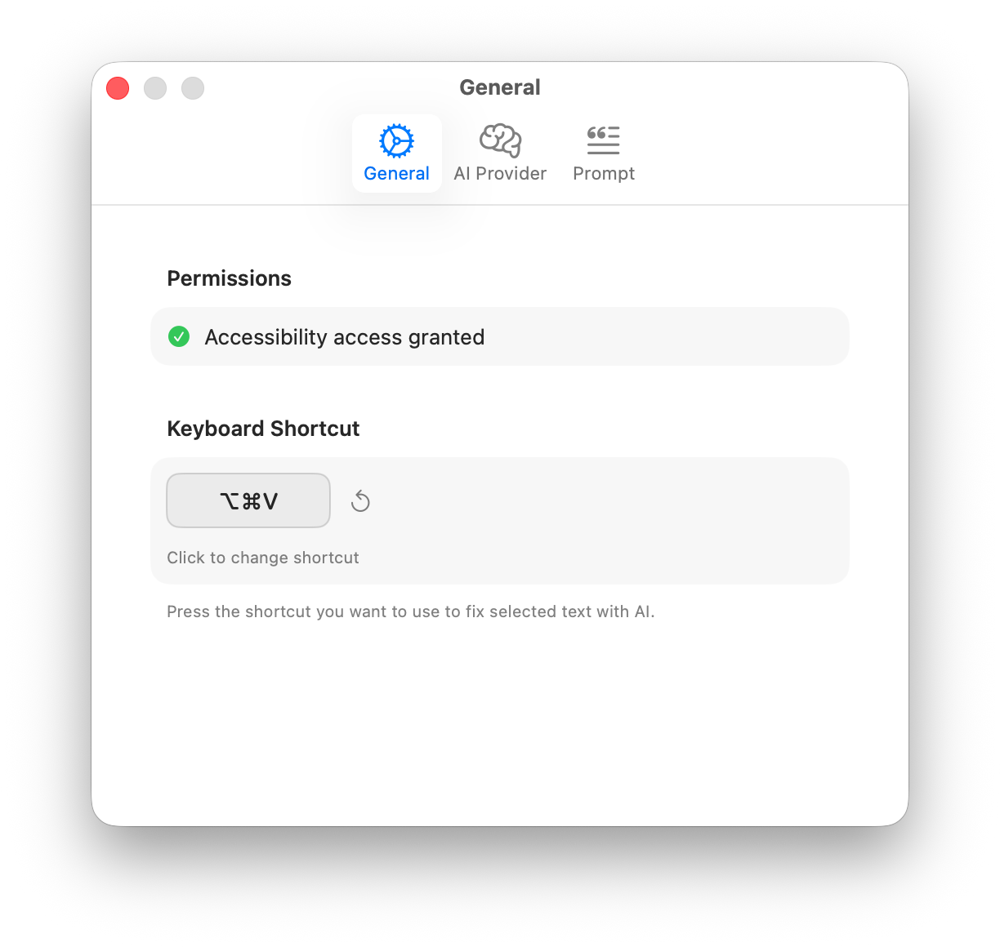
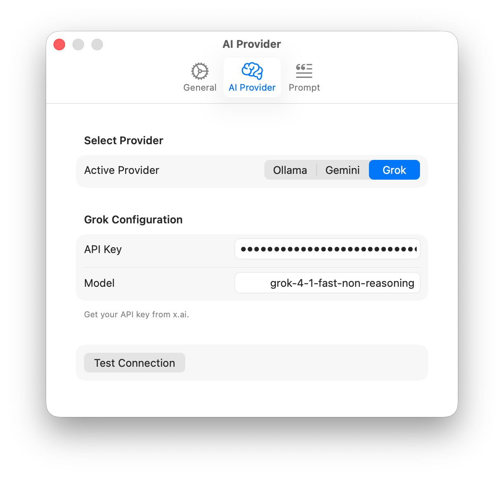
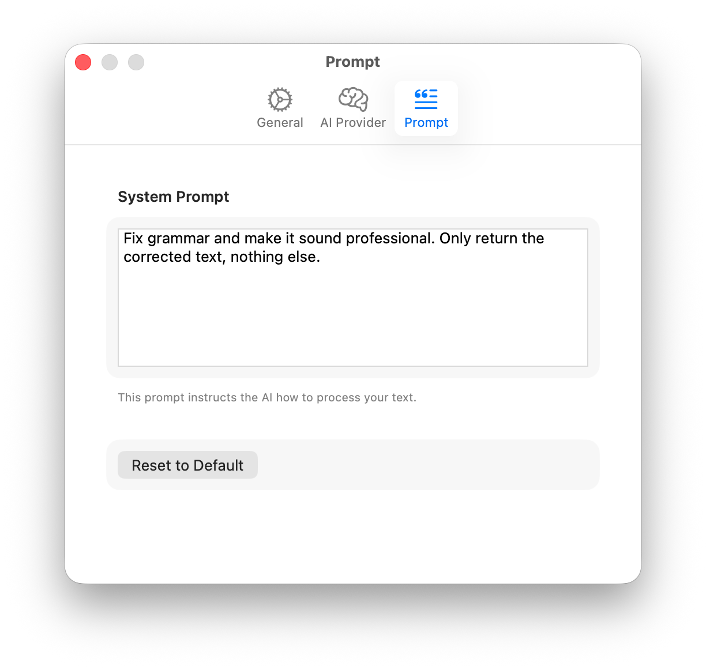

# Documentation Structure

This directory contains all feature-related documentation for the project.

## User Guide

For complete usage instructions, see the [User Guide](./USER_GUIDE.md).

### Installation

1. Download Pouf from the [releases page](https://github.com/rickywo/Pouf/releases) or build from source
2. Move `Pouf.app` to your Applications folder
3. Launch Pouf - it will appear in your menu bar
4. Grant Accessibility permissions when prompted (required for text selection and injection)

### Quick Start

1. Click the Pouf icon in the menu bar to access settings

   

2. Configure your keyboard shortcut in the **General** tab

   

3. Select your AI provider in the **AI Provider** tab (Ollama, Gemini, or Grok)

   

4. Customize your system prompt in the **Prompt** tab

   

5. Select any text in any application and press your keyboard shortcut to enhance it!

---

## Documentation Organization

Each feature has its own subdirectory containing standardized planning documents:

```
/docs
├── README.md           # This file - explains the documentation structure
├── _template/          # Templates for new feature documentation
│   ├── README.md
│   ├── PLAN.md
│   └── CHECKLIST.md
├── snapshots/          # App screenshots for documentation
└── <feature-name>/     # One directory per feature
    ├── README.md       # Feature overview, goals, and requirements
    ├── PLAN.md         # Implementation plan with phases and tasks
    └── CHECKLIST.md    # Progress tracking checklist
```

## Creating Documentation for a New Feature

1. Copy the `_template` directory and rename it to your feature name (lowercase, hyphenated).
2. Fill in each document with your feature-specific content.
3. Update the checklist as you make progress.

## Current Features

- [flowstate](./flowstate/) - Documentation folder structure standardization
- [01_configurable_ai_providers](./01_configurable_ai_providers/) - Multiple AI provider support

## Conventions

- Feature directory names should be lowercase and use hyphens for spaces.
- Each feature must have all three documents: `README.md`, `PLAN.md`, and `CHECKLIST.md`.
- Keep documentation up to date as the feature evolves.
